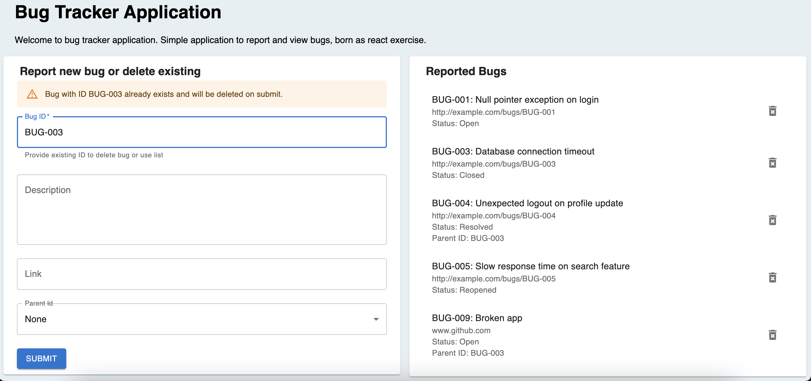

# Bug tracker application

Bug tracker a simple web application for tracking bugs and storing them in database (simulated by Csv). Frontend consists of form to collect bug and list of existing bugs.

It includes a front-end built with Vite, React and Material-UI, a back-end powered by Node.js and Express, and is managed within an Nx monorepo. The project uses TypeScript for type safety, Prettier for code formatting, ESLint for linting, and Jest for unit testing.

Disclaimer: This is small exercise not a real application.

## How to use

Application is very simple, it consists of simple page containg both bug tracking form and list of all reported bugs.
Bug is added to list and csv when form is submitted, mandatory field is only id (although, I other rules could be added). If user enters existing ID, warning is displayed. If form with existing bug ID is submitted, "Are you sure" dialog is displayed. If user continues, bug with such ID is deleted.

On the other side, the application contains list of all bugs. If it was real application, filters would be handy, in this case only action available in the list is to delete the bug.

## Start application in Docker

### Docker compose

This repo contains docker-compose file with everything set up. Make sure you have docker available.

1. Then just run `docker-compose build` in this repository to build images.
2. `docker-compose up` to run the containers.
3. Check working application on [http://localhost/]

### Backend (Obsolete)

Backend image is build with command

Run `nx run api:docker-build `
Launch container with options:

- Host port 3333

#### Frontend (Obsolete)

Run `nx run bug-tracker-frontend:docker-build `
Launch container with options:

- Map some host port where you want to use your app

## Start the application using NX

1. Install dependencies `npm i`
2. Run the API using `nx serve api` and keep it running
3. In anothe terminal Run the frontend project using `nx serve bug-tracker-frontend`, application will start on <http://localhost:4201/>

### Unit tests

To run tests use `nx test` command e.g. `nx test bug-tracker-frontend` or `nx test bug-tracker-csv-utils`

### E2E tests

- API tests - First serve API project in one terminal `nx serve api` and then run `nx e2e api-e2e` to run API tests
- Nx creates skeleton project for Frontend Cypress tests, but I didn't manage to write any. So this time it is empty.

### Possible improvements

As this is just a small exercise, room for improvement is huge.
However error handling and presentation could be handled more nicelly, presenting more information why certain action failed.

Frontend could benefit from use of context or redux, if new functionality should be added.
Some form field validation would be also reasonable, e.g. for link.
Also test coverage could be always higher.
